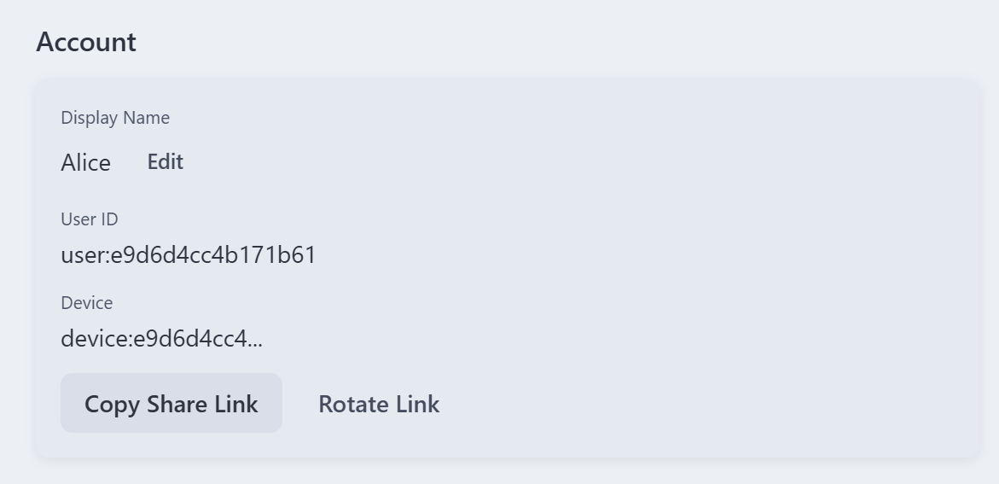

# TapChat

A decentralized instant messaging app built for censorship resistance and metadata privacy.

## Overview

TapChat is a decentralized instant messaging system. Each user owns and controls their own transport components. The architecture consists of:

- **Client**: The local client core, responsible for state management, encryption, and decryption. Only the Client handles plaintext messages.
- **Inbox**: The source of truth for message queues and message indexes.
- **Storage**: A blob storage service for attachments and large messages.
- **Wakeup**: A notification component used to remind the client to sync the Inbox. It can be optional on desktop.

Because these components are user-deployed and user-controlled, there is no central server that holds all messages and metadata.

## Features

- End-to-end encryption using OpenMLS, compatible with MLS (RFC 9420)
- A decentralized architecture where each user owns their own transport components
- Messaging flows designed around metadata privacy
- Real-time subscriptions over WebSocket
- Cross-device identity derivation based on BIP39 / BIP32

## Project Structure

```text
src/                     # Rust core library
  identity/              # BIP39 identity system
  mls_adapter/           # OpenMLS integration
  model/                 # Core data structures
  ffi_api/               # FFI interface for platform bindings

services/cloudflare/     # Cloudflare reference backend
  inbox/                 # Inbox Durable Object
  storage/               # R2-backed blob storage

app/desktop/             # Tauri desktop application
  src/                   # React frontend
  src-tauri/             # Rust backend bindings
```

## Current Status

**v0.1**: The repository already includes the main implementation path for 1-to-1 private chat, including the Rust core, the Cloudflare reference transport layer, and the desktop app.

## Quick Start

You can download the latest installer from [GitHub Releases](https://github.com/koabula/TapChat/releases).
Using TapChat Desktop requires a Cloudflare account with Worker and R2 object storage enabled.

### Initialization

The first time you open TapChat, you need to create a Profile. Follow the in-app onboarding flow. In Step 4, the app will redirect you to the Cloudflare login page. After authorization, return to TapChat to continue.

### Add Contacts

TapChat does not rely on a central server for contact discovery. Instead, it uses Share Links so other people can add you. You can copy or rotate your Share Link in Setting > Account.



After you get your friend's Share Link, click the + button in the lower-left corner of the main window and paste the Share Link. You will then see your friend's profile. Clicking Chat will automatically send a contact request.

When you receive a contact request, it will appear in Message Request. Open it and accept the request.

After that, both sides can start chatting.

## Developer Setup

### Prerequisites

- Rust 1.70+
- Node.js 18+
- Cloudflare account (for deploying the reference backend)

### Build

```bash
# Build Rust core
cargo build

# Launch the desktop app
cd app/desktop
npm install
npm run tauri:dev
```

## License

MIT
