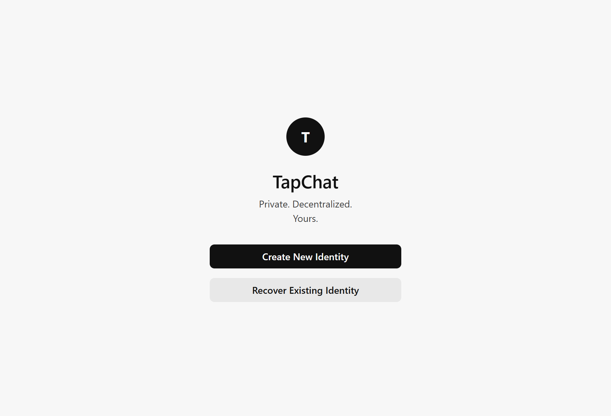
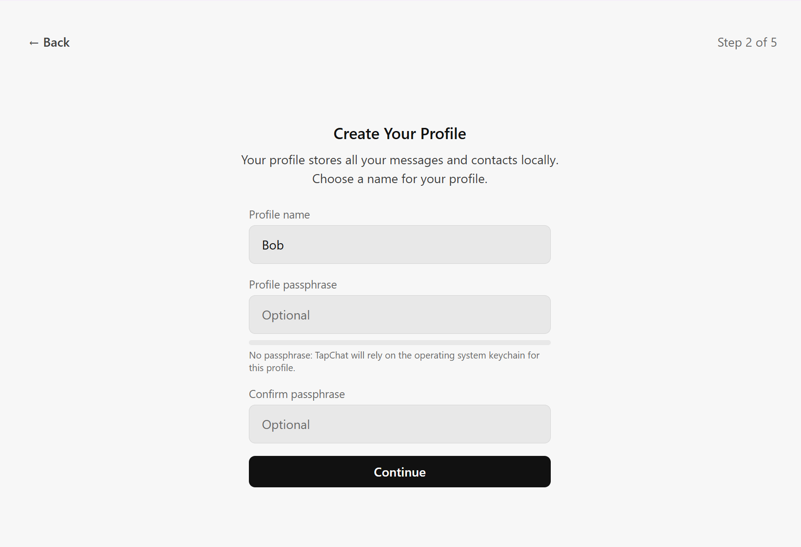
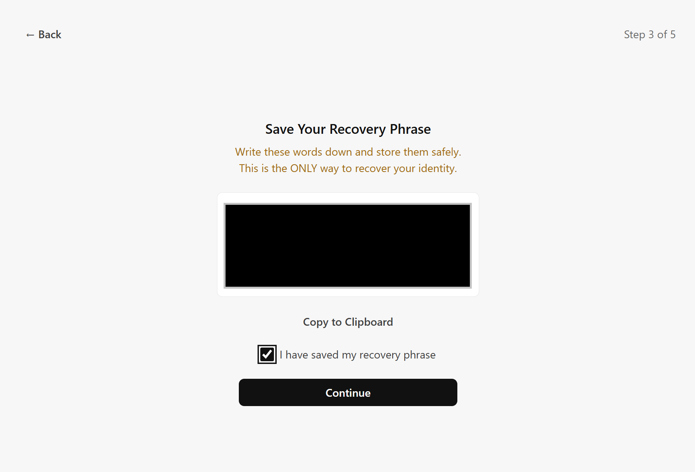
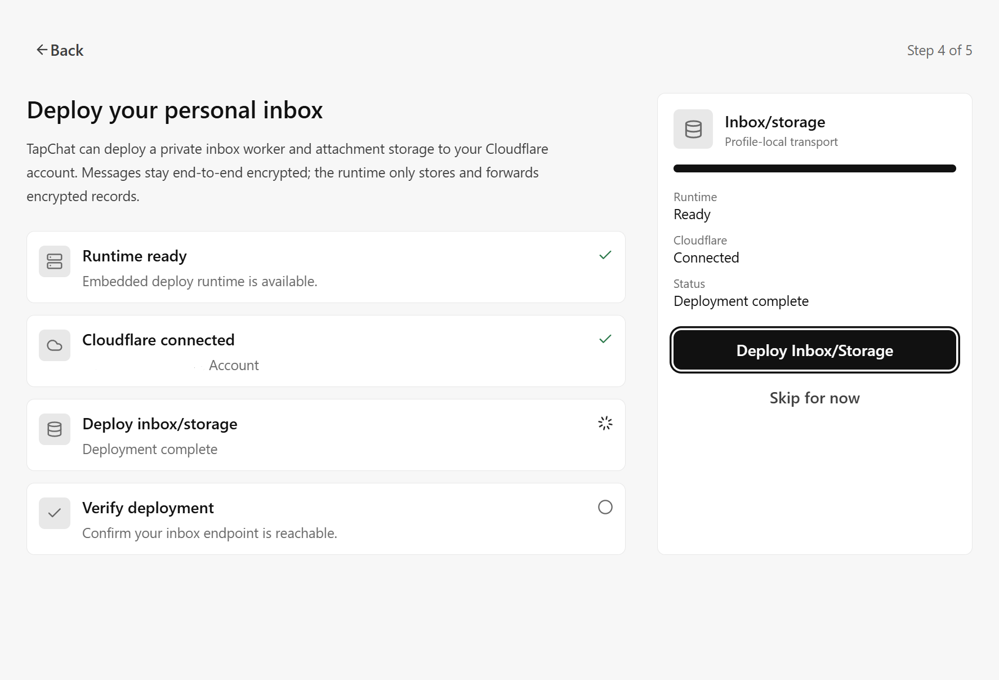
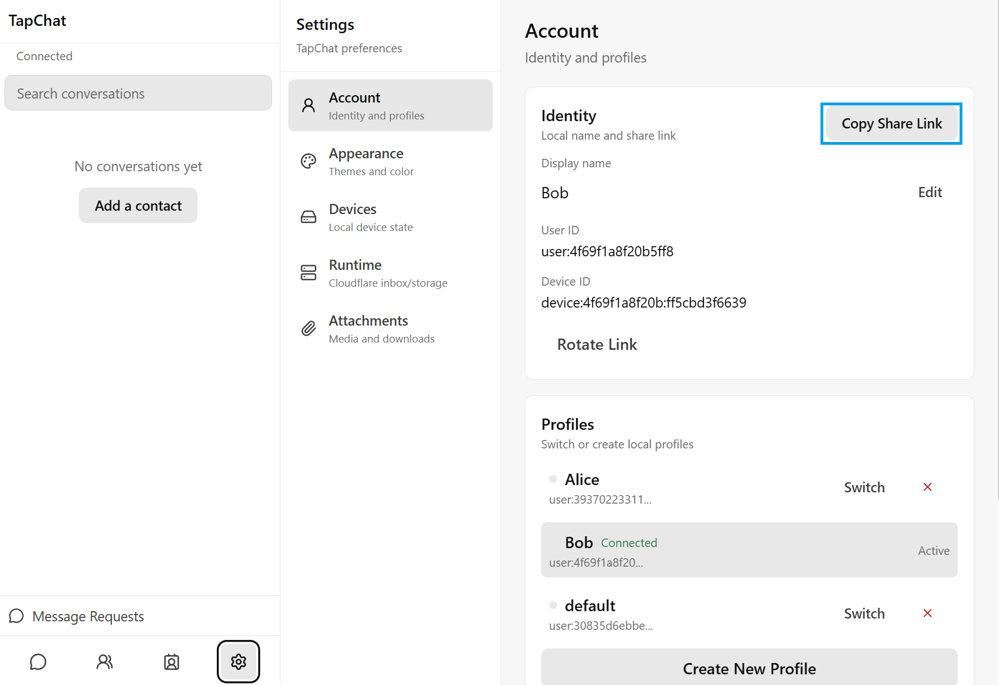
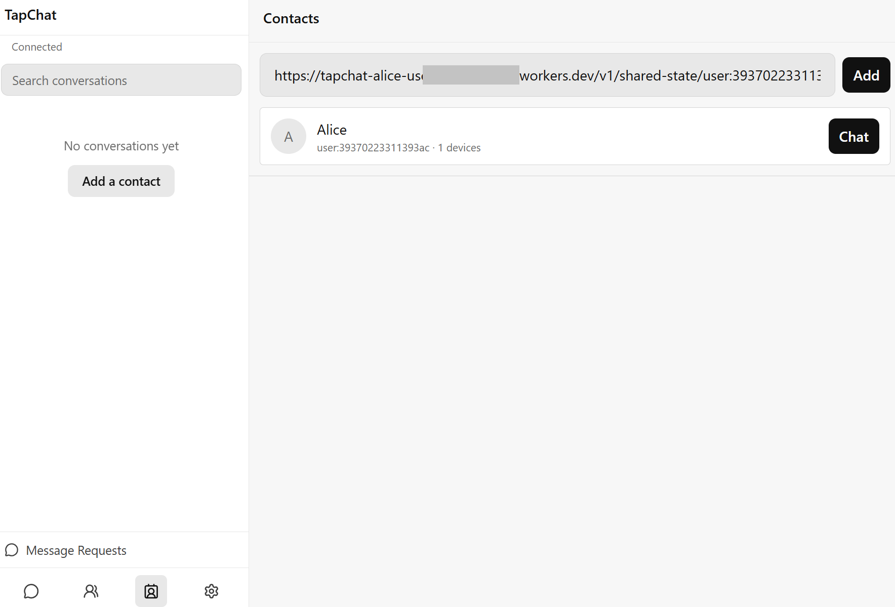
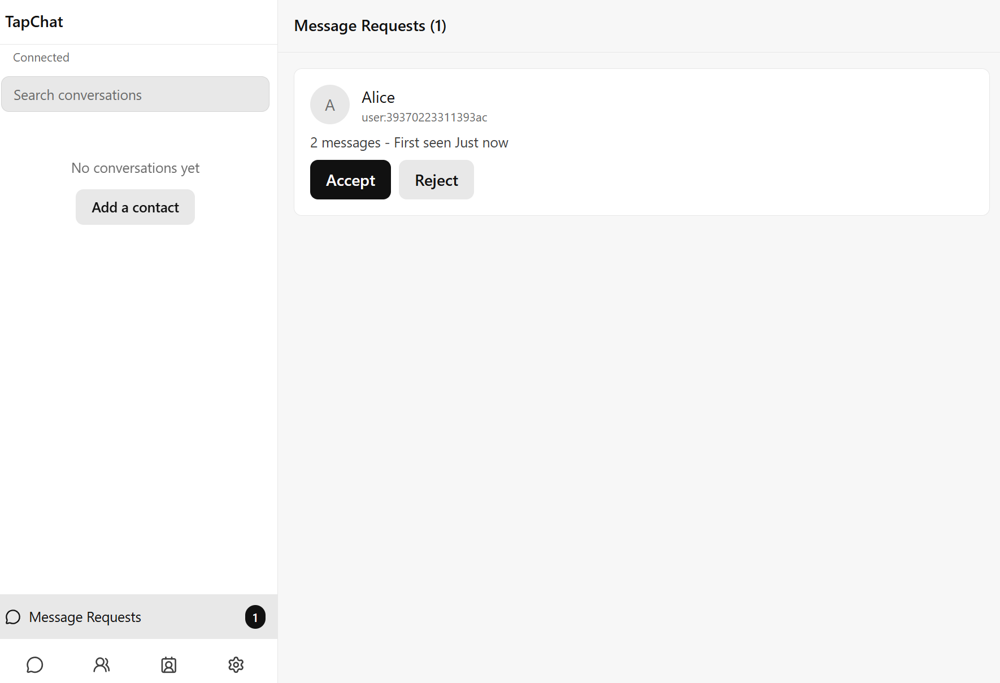

# TapChat

English | [中文](./README_CN.md)

User-provisioned transport for censorship-resistant and metadata-private messaging.

TapChat is an early public alpha. It is suitable for experimentation, protocol feedback, and small-scale trials. It has not received an external security audit and should not yet be relied on for high-risk communications.

## What is TapChat?

TapChat is an end-to-end encrypted messaging app where every user owns their own transport components. Instead of sending all messages through one central TapChat server, each user provisions an Inbox and Storage endpoint that other contacts can use with limited capabilities.

The client is the only place where plaintext messages are handled. The reference desktop app can deploy the transport layer into a user's own Cloudflare account.

## Why user-provisioned transport?

Most messaging systems still depend on a central service for message delivery, account state, and metadata aggregation. TapChat explores a different model:

- users control the transport layer used to receive messages
- contacts receive only the minimum capability needed to send encrypted envelopes
- message history is synchronized by cursor, not by best-effort push state
- attachments are encrypted locally before being uploaded as blobs

This does not remove all metadata. Network timing, account-level Cloudflare metadata, and contact graph hints can still exist. The goal is to reduce centralized control and metadata concentration while keeping the app usable.

## How it works



- **Client** runs locally, owns identity state, performs encryption and decryption, and manages conversations.
- **Inbox** is the source of truth for small message envelopes and message indexes.
- **Storage** stores encrypted blobs such as attachments and large payloads.
- **Inbox.Subscribe** provides an online WebSocket sync path for desktop clients.
- **Wakeup** is a future best-effort notification layer for mobile/background sync.

TapChat currently ships a Cloudflare reference transport using Workers, Durable Objects, WebSocket, and R2. The protocol is designed so other transport implementations can be added later.

## Current status

| Area | Status |
| --- | --- |
| Ready for alpha testing | Desktop app, direct messaging, Cloudflare reference transport, attachments, WebSocket sync |
| Experimental | Group chat, multi-device group semantics, recovery hardening |
| Not yet | Mobile wakeup bridge, external security audit, production-scale deployment guidance |

## Try the desktop alpha

1. Download the latest installer from [GitHub Releases](https://github.com/koabula/TapChat/releases).
2. Prepare a Cloudflare account with Workers, Durable Objects, and R2 enabled.
3. Open TapChat Desktop and follow the onboarding flow below.
4. Exchange Share Links with someone you trust to start a chat.

There is no central TapChat directory or username search. Contact discovery is intentionally manual in this alpha.

## How to use it

### Onboarding

**1. Start onboarding.** Open TapChat and choose whether to create a new identity or recover an existing one.



**2. Create a local profile.** Choose a local profile name and optionally set a passphrase for this device.



**3. Back up the recovery phrase.** Store the phrase safely before continuing; it is required to recover the identity.



**4. Deploy or connect the Cloudflare runtime.** Connect Cloudflare, deploy the Inbox and Storage runtime, then verify that the endpoint is reachable.



### Chat

**1. Copy your Share Link.** Open Settings > Account and copy the link you want to share.



**2. Add a contact.** Paste someone else's Share Link, click Add, then open the chat.



**3. Accept the message request.** The recipient accepts the request before both sides start chatting.



## Developer setup

Prerequisites:

- Rust stable
- Node.js 20+
- Cloudflare account for real transport deployment

Useful commands:

```bash
# Rust core
cargo build
cargo test -q --lib

# Cloudflare reference transport
cd services/cloudflare
npm install
npm run check
npm test

# Desktop app
cd app/desktop
npm install
npm run tauri:dev
```

## Security note

- Plaintext messages should only exist in the client.
- The Cloudflare reference transport stores and routes encrypted envelopes and encrypted blobs; it should not be able to decrypt message contents.
- TapChat still exposes some metadata through network timing, endpoint access, account-level infrastructure, and user-controlled deployment choices.
- The project has not received a third-party security audit.
- Do not use this alpha for high-risk or life-critical communication.

## Project layout

```text
src/                     Rust core and CLI
  identity/              BIP39/BIP32-based user identity and device binding
  mls_adapter/           OpenMLS integration
  ffi_api/               command/event/effect API for platform bindings
  transport_contract/    transport-facing request and response types

services/cloudflare/     Cloudflare reference transport
  src/inbox/             per-device Inbox Durable Object
  src/storage/           R2-backed encrypted blob storage
  src/group-outbox/      experimental group outbox

app/desktop/             Tauri desktop app
  src/                   React UI
  src-tauri/             Rust desktop backend and platform ports
```

## License

MIT
